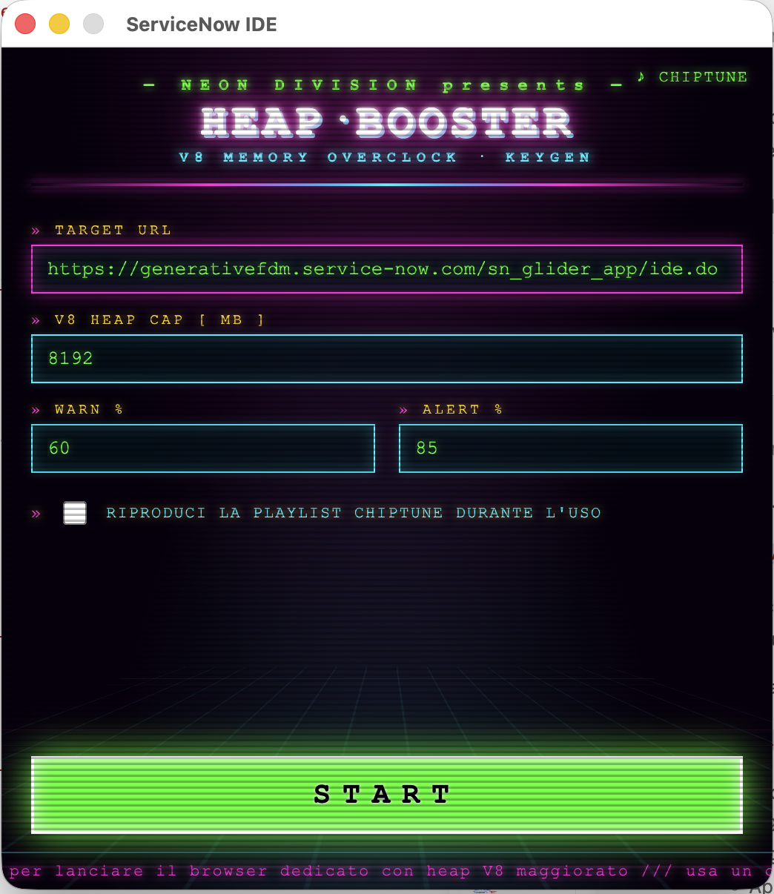

# ServiceNow IDE Wrapper – Heap Booster

A dedicated Electron wrapper for ServiceNow's web-based IDE that boosts V8 heap memory, monitors RAM usage in real-time, and adds a chiptune soundtrack to your development workflow.

## Goal

**Heap Booster** solves memory constraints when working with large or complex ServiceNow instances. The standard browser limits JavaScript heap to ~2 GB, which can cause frequent crashes when navigating large codebases, running builds, or managing memory-intensive operations. This wrapper:

- **Increases V8 heap limit** — Configurable from 1,024 MB to 14,336 MB (up to 12 GB on a 16 GB system is recommended)
- **Real-time memory HUD** — Visual semaphore (green → yellow → red) anchored to your IDE window, with memory usage in MB and percentage
- **Automatic recovery** — Reloads the IDE on crash; alerts you if crashes persist
- **Optional chiptune playlist** — Loop a neon-themed soundtrack during work (or mute it anytime)
- **Quick configuration** — Change URL, memory cap, and thresholds without editing files (though `config.json` is editable for power users)

## Created By

[Francesco Di Maggio](https://www.linkedin.com/in/francescosaveriodimaggio)

## What It Looks Like



The HUD displays:
- **Target URL** — The ServiceNow instance you're working on
- **V8 Heap Cap** — Your configured memory limit in MB
- **Thresholds** — WARN and ALERT percentages that drive the semaphore color
- **Playlist toggle** — Activate the chiptune soundtrack during your session
- **Real-time memory meter** — Updates every 2 seconds with RSS usage and alert notifications

## Installation & Quick Start

### Run from Source (Bun)

**1. Install Bun**

This project uses [Bun](https://bun.sh) as its package manager and runner. Install it with:

```bash
curl -fsSL https://bun.sh/install | bash
```

(Windows: `powershell -c "irm bun.sh/install.ps1 | iex"`. See the [Bun installation docs](https://bun.sh/docs/installation) for Homebrew, npm, and other options.)

Verify the install:

```bash
bun --version
```

**2. Install dependencies**

From the project root:

```bash
bun install
```

This pulls down Electron and electron-builder. Electron's platform binary isn't fetched at install time — it downloads automatically the first time you run the app, so the first `bun run start` takes a little longer.

**3. Launch the app**

```bash
bun run start
```

The Keygen launcher opens — paste your ServiceNow instance URL, set the heap cap, and press **START**.

To package a distributable instead of running from source:

```bash
bun run dist        # .dmg (macOS)
```

### macOS

1. Download `ServiceNow IDE-1.0.0-arm64.dmg` (Apple Silicon) or `-x64.dmg` (Intel)
2. Mount the DMG and drag **ServiceNow IDE** to `/Applications`
3. Launch from Applications or Spotlight (Cmd+Space → "ServiceNow IDE")
4. Paste your instance URL and press START

### Windows / Linux

Currently, builds are provided for macOS only. To build for your platform:

```bash
bun install
bun run dist
```

Outputs will appear in `dist/` as `.exe` (Windows) or `.AppImage` (Linux).

## How Instance Management Works

### First Launch

When you first start **Heap Booster**, you see the **Keygen** launcher screen:

1. **Set Target URL** — Paste the full URL to your ServiceNow instance (e.g., `https://my-instance.service-now.com/sn_glider_app/ide.do`)
2. **Set V8 Heap Cap** — Choose how much JavaScript memory to allocate (default: 8192 MB)
3. **Set Thresholds** — WARN % (e.g., 60%) and ALERT % (e.g., 85%) determine when the HUD changes color
4. **Enable Chiptune** — (Optional) Check the box to loop the neon soundtrack during work
5. **Press START** — The IDE launches with your settings

Settings are saved to `config.json` in your user data directory (macOS: `~/Library/Application Support/com.fdm.servicenow-ide-ba/`, Linux: `~/.config/com.fdm.servicenow-ide-ba/`, Windows: `%APPDATA%/com.fdm.servicenow-ide-ba/`). The file persists across updates.

### Change Settings Later

Once the IDE is running:

- **File → Settings** (Cmd+,) — Opens a GUI to change URL, memory cap, and thresholds
  - If you change the memory cap, the app restarts automatically to apply the new V8 flag
  - If you change the URL, the page reloads immediately to the new instance
- **File → Open configuration (file)** — Opens `config.json` in your default text editor for advanced tweaking
- **File → Show configuration folder** — Opens the folder containing your settings

### Multiple Instances

You can only run one instance at a time within this wrapper. To test against multiple ServiceNow instances:
- Change the URL in Settings and reload
- Or run multiple copies of the app (macOS: duplicate the `.app` in Applications)

## Memory Monitor & HUD

The HUD is a small, **always-on-top** overlay in the bottom-right corner of your IDE window. It shows:

- **Colored dot** — Green (healthy) → Yellow (warning) → Red (critical memory pressure)
- **Memory usage** — Current RSS in MB and percentage of your cap
- **Semaphore thresholds** — Configurable in Settings (e.g., green until 60%, yellow 60–85%, red ≥85%)
- **Audio controls** — Play/pause and volume slider (when a playlist is configured)

### Click-Through vs. Interactive

By default, the HUD is **click-through** — clicks pass through to the IDE, so you don't accidentally hit it. If you want to use the audio controls:

- **HUD → HUD interattivo** (Cmd+Shift+H) — Toggles mouse capture so you can click the HUD buttons
- **Turn it off** when done so clicks go back to the IDE

### Memory Alerts

When the IDE reaches **red** (≥ ALERT %), you get a **macOS notification** warning you to save your work or increase the memory cap. Once memory drops below **yellow**, the alert resets so you're only notified once per spike (no spam).

## Chiptune Playlist Management

### Enable / Disable

- **File → Settings** → Check "Enable chiptune playlist" at first launch (applies on START)
- Or at runtime: **Audio → Playlist neon** (checkbox)
  - Menu updates in real-time: check to play, uncheck to pause

### Play / Pause / Skip

- **Audio → Playlist neon** — Toggle play/pause
- **Audio → Brano successivo** — Skip to next track (Cmd+Right)
- **HUD controls** — If the HUD is interactive (Cmd+Shift+H), click the **▶** button to play/pause and drag the volume slider

### Customize the Soundtrack

Tracks live in `assets/playlist/` inside the app. To add your own chiptune:

1. Locate the app package (e.g., `/Applications/ServiceNow IDE.app`)
2. Right-click → **Show Package Contents** → `Resources/` → `assets/playlist/`
3. Drop in `.mp3` files — they'll appear alphabetically in the player
4. Restart the app; the new tracks load automatically

(Or edit and rebuild the app using `bun run dist` if you're developing.)

## Development

### Requirements

- [Bun](https://bun.sh) 1.0+ (or Node.js 16+ with npm)

### Build the App

```bash
bun install
bun run start       # Run in development mode
bun run dist        # Package as .dmg (macOS)
```

### Key Files

- `main.js` — Electron main process, memory monitoring, HUD, audio control, config management
- `launcher.html` — Keygen landing screen (neon retro theme)
- `hud.html` — Real-time memory semaphore and audio player
- `settings.html` — GUI for changing URL, RAM cap, and thresholds
- `assets/login.mp3` — Cracktro (startup sound)
- `assets/playlist/` — Chiptune tracks (drop `.mp3` files here)

### How It Works

1. **V8 Heap Flag** — `--max-old-space-size` is set at app startup (can't change at runtime, so we relaunch on RAM change)
2. **Memory Monitor** — Checks `app.getAppMetrics()` every 2 seconds and broadcasts to the HUD
3. **Crash Recovery** — Automatically reloads the page up to 3 times within 60 seconds; if crashes persist, asks the user
4. **Cross-Origin Isolation** — Injects COOP/COEP headers so ServiceNow's VS Code Web worker loads in Electron's strict security model
5. **Autoplay Audio** — Sets `autoplay-policy: no-user-gesture-required` so the cracktro and playlist don't require a user gesture to start

## License

MIT

---

**Stay frosty.** 🟢
